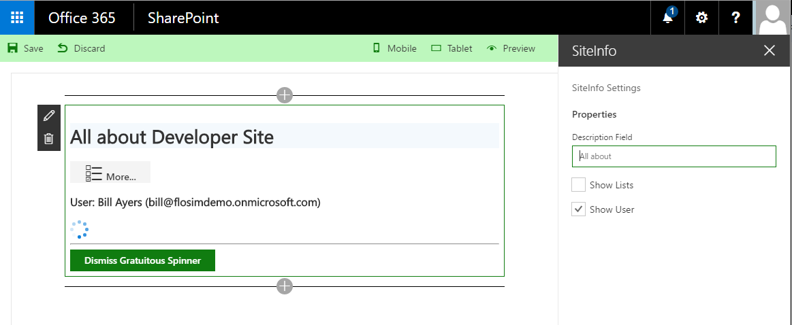

# SiteInfo

This is a sample SharePoint Framework web part using React, Office-UI-Fabric-React and PnP-JS-Core.



Although the web part has quite a lot of user interaction, and uses Office UI Fabric
effects like the animated side panel, a spinner and web part properties, the web part
component itself requires only relatively few lines of code. This is because the Office UI Fabric
components and the PnP-JS-Core libraries do a lot of the work.

## Looking at the code

Some things to note are that the code is in the SiteInfo.tsx component.
This is a React component called from SiteInfoWebPart.ts which is as generated
by the Yeoman generator with the exception of an additional property that is
passed to the component containing the *this* reference. If we did not pass
it through the properties, we would not have access to things like
*this.context* within the component because the TypeScript class will
be transpiled to a new function scope.

### React

If you are not familiar with React, the SiteInfo component code will look very strange.
Note how the *render* method returns what looks like HTML markup without being in a
literal string - how can this be? React uses a superset of JavaScript called JSX which
is precompiled into plain JavaScript. In TypeScript we use the TSX file extension
and the TypeScript compiler also knows how to do the JSX conversion.
The markup elements are converted into JavaScript that will create instances of
the React components, which are virtual DOM elements which will eventually be sychronised
with the actual DOM in the browser. Whenever the JSX compiler sees braces it will switch
off the markup conversion and pass through the JavaScript. This is how the script inside
the braces is allowed through, which is fundamentally different to using a template
engine like handlebars, because the whole expression is actually JavaScript.
You can see the resulting output after compilation (both JSX and TypeScript) by looking at
**lib/webparts/siteInfo/components/SiteInfo.js**, which is not easy to read
but gives an understanding of what is happening.

A few people ask how React compares to, say, Angular. This isn't really that useful a
comparison because Angular gives you a complete SPA framework whereas React is just a
view engine. One of the biggest differences is that React allows you to build web
components and this also gives you a slightly different view on how you break down
your application. Most frameworks use some form of MVx pattern but if you can break
your solution into smaller components the horizontal layering becomes less of a
necessity. It also removes the need for two-way data-binding, and instead you
can simply re-render everything when something changes. This would of course
be very inefficient if it required a re-rendering of the DOM, but React contains
an intelligent diff mechanism that compares the virtual and actual DOMs and only
updates DOM elements that have changed since the last time they were updated.

The React components each have a *state* which is a kind of component-scoped view-model.
This is how the UI is updated in response to user interaction, e.g. clicking on buttons.
The web part property pane, on the other hand, updates the properties of the component.
Updating the properties or updating state (using the setState method) will result in
the **render** method being called. Within the **render** method there are calls to
other methods that render, for example, the user information. This is one way of
breaking down the rendering function into manageable pieces, but another way
would be to make the user information another component in its own right, and include
it using markup. The decision on whether to make something a separate component
is largely dependent on whether you think there is an opportunity to re-use that
component elsewhere.

### Office UI Fabric

The convention in React is to use lower case element names for HTML5 elements and
upper camel-case for React components. You can see in the sample that there are a number
components that are brought in from the Office-UI-Fabric-React library.
Normally you would import just those components you need, especially for production code,
but in the sample there
is a wildcard mapping so you can get at any of the components using **fabric** as
the root object.

If you look at the markup needed to generate each of these components using plain
HTML they are quite complicated using several nested elements. The Office UI Fabric React
components encapsulate this and make it much easier, and save many lines of markup.

You can see that some of the Office UI Fabric classes have been used to decorate
various elements. Remember that in React you have to use **className** instead of **class**.
This is because **class** is a reserved word, but because the code looks like regular
HTML markup the muscle memory takes over and it is a very easy mistake to make.

### PnP-JS-Core

If you have seen samples using AJAX calls to retrieve or update SharePoint data, you
will know that it is non-trivial, and that you have to deal with things like HTTP
headers and so forth. The PnP-JS-Core library makes using the SharePoint REST
interface a lot easier with a very intuitive fluent-style API.
Examining the code you can see that there are two REST calls made with the library, each
made with just a few lines of code, because most of the hard work is done by the library.
The callback functions (using a 'cool' lambda expression to satisfy the demands of the
tslint configuration) update the state using the **setState** function, which will result
in a call to the render event if something changes.

There is already a dependency in the sample code which will be
resolved when you do an npm install, but if you want to add PnP-JS-Core to
a project you can install it from the command line:

```npm install --save sp-pnp-js```

PnP-JS-Core documentation can be found on [GitHub](http://github.com/OfficeDev/Pnp-JS-Core).

## Building the code

```bash
git clone https://github.com/SPDoctor/SiteInfo.git
npm install
npm install -g gulp
gulp serve
```

The package produces the following when built:

* lib/* commonjs components - this allows this package to be reused from other packages.
* dist/* - a single bundle containing the components used for uploading to a cdn pointing a registered Sharepoint webpart library to.
* temp/* a test page that hosts the components in this package.